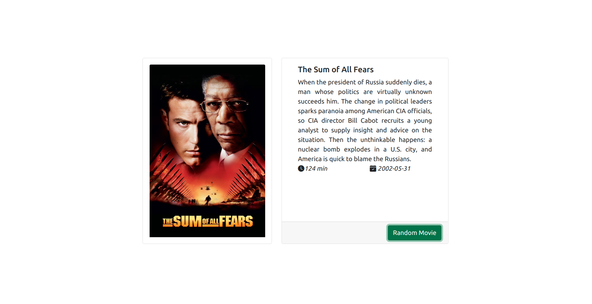

# Random Movies

Random Movies is a django application to randomly display movie information
[Live Demo](https://the-random-movies.herokuapp.com/)




## Local Installation
Let's create a virtual environment
```
sudo apt install python3-venv
python3 -m venv venv
source venv/bin/activate
```

Use the package manager [pip](https://pip.pypa.io/en/stable/) to install dependencies.

```bash
pip install -r requirements.txt
```

Configure environment variables
```bash
cp .env-example .env
```
The **THEMOVIEDB_API_KEY** variable can be obtained from [The Movie Database API](https://developers.themoviedb.org/)


Configure database migrations:

```
python3 manage.py makemigrations
python3 manage.py migrate
```

Execute:

```
gunicorn movies.wsgi
```

## Add Movies

After installation the database will be empty. We need to add movies to the database. For that, go to:

```
http://127.0.0.1:8000/api/seed
```


## License
[MIT](https://choosealicense.com/licenses/mit/)